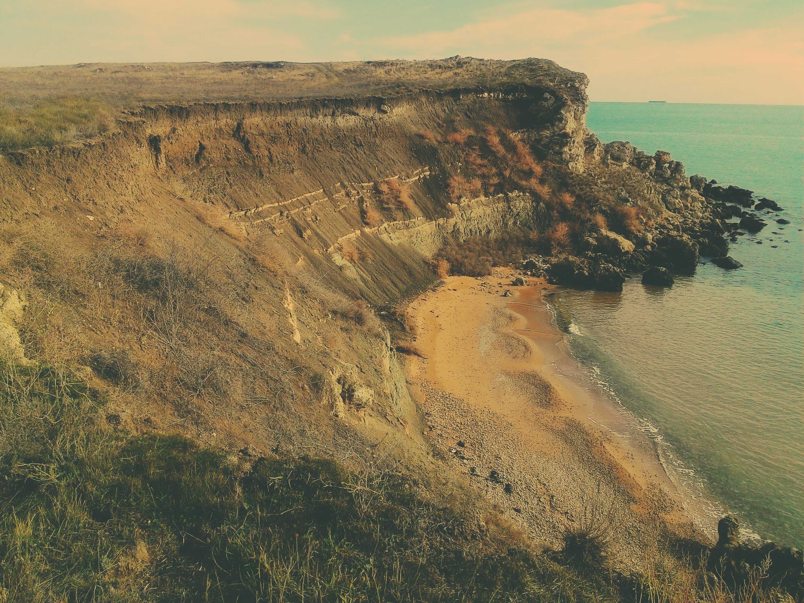
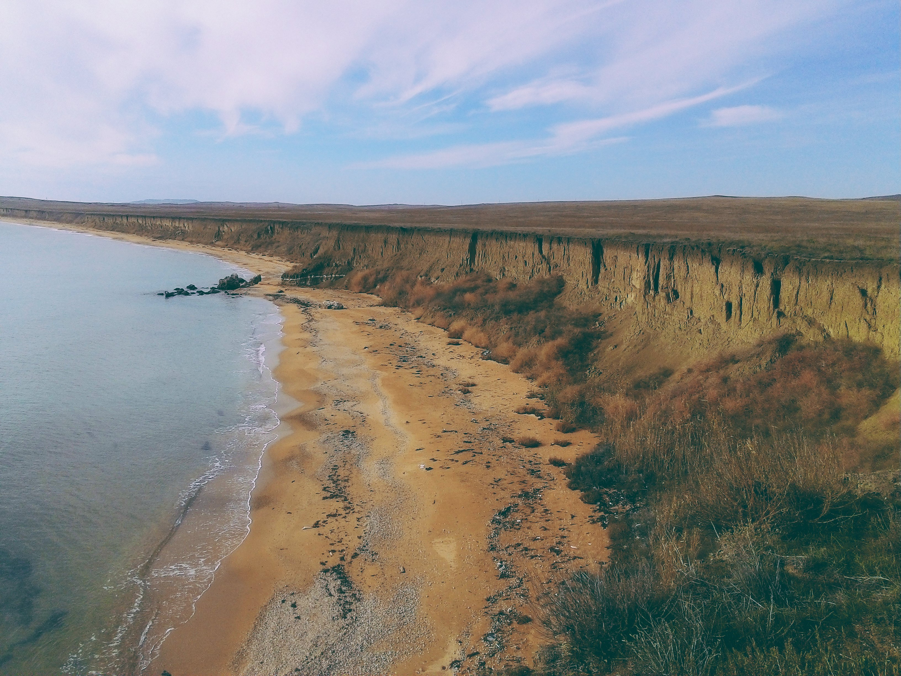
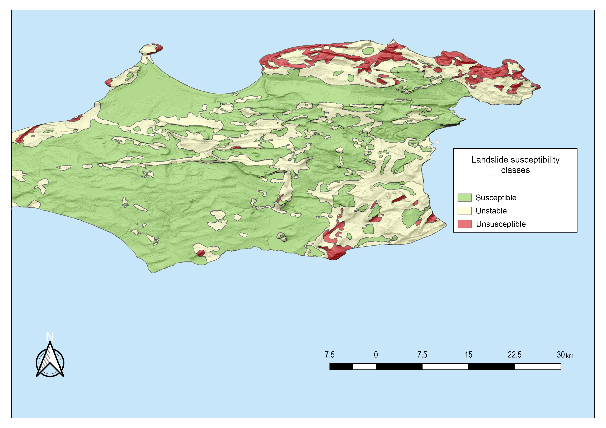

  
  
  
  

Landslides are one of the most important problems on Kerch Peninsula. Rapidly increasing anthropogenic pressure, which has been particularly could be seen in recent years, leads to destabilization of slopes and significant economic and social damage. 

Nowdays, economic activities for the further development of Kerch Peninsula, urbanization and the construction of new infrastructure facilities may lead to destabilization of slopes and activation of landslides. 

Application of an integrated mathematical model, helped us to reflect the current state of Kerch Peninsula in the context of solving this problem. With the help of field research, we mapped a complex of landslide areas, which made it possible to identify the main types of them occurring here – earth and earthwork slips landslides, and in the coastal zone – landfalls and caving slides, total area of which reaches 87.5 km2 (7.4% of the research area territory). 

We chose an optimal method under the given conditions – the weight of evidence. The approach  allows us to classify the territory according to the degree of its susceptibility to landslides with rather high accuracy and analyze the existing situation in this area and analyze possible scenarios for its development. 

We zoned the territory of the Kerch peninsula into 3 classes – stable, unstable and unsusceptible according to the degree of landslide probable occurrences. The susceptibility analysis revealed that the factors causing the activation of landslides on the Kerch Peninsula are the slope steepness from 20 to 40 degrees, the anthropogenic impact, excessive salinity of the soil cover and the lithological composition of the terrain.

